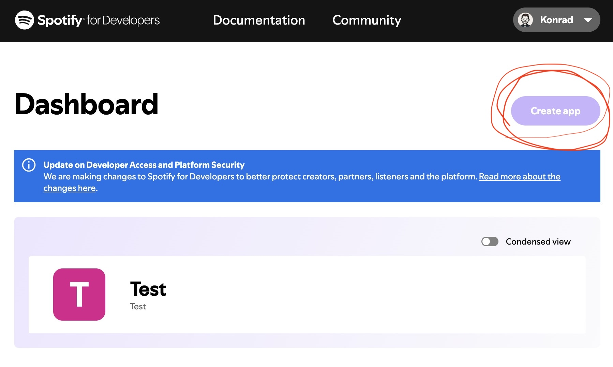
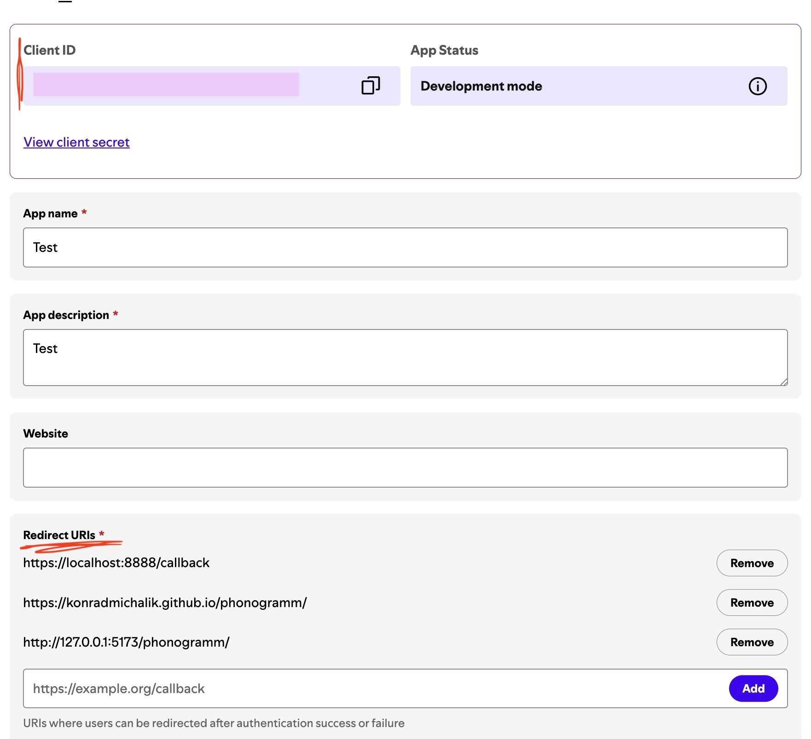
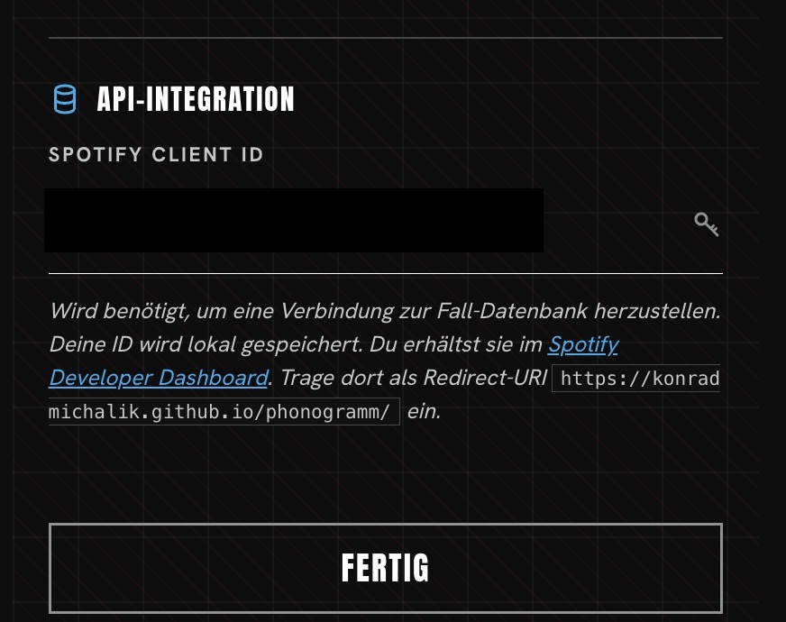
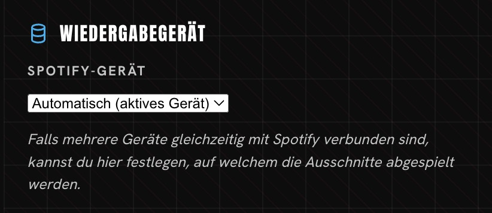

# Phonogramm – Anleitung zur Einrichtung

Die App läuft unter: https://konradmichalik.github.io/phonogramm/

> Voraussetzung: Ein Spotify-Premium-Account. Ohne Premium funktioniert die Fernsteuerung von Spotify nicht.

## Spotify-App-Zugang einrichten (einmalig)

Damit Phonogramm dein Spotify steuern darf, brauchst du eine kostenlose „Zugangskarte" von Spotify:

1. Gehe auf https://developer.spotify.com/dashboard und logge dich mit deinem Spotify-Account ein.
2. Klicke auf „Create app" und vergib einen beliebigen Namen (z. B. „Phonogramm").

3. Trage bei „Redirect URI" genau diese Adresse ein:
   https://konradmichalik.github.io/phonogramm/
4. Speichern. Danach siehst du eine Client ID (eine Buchstaben-/Zahlenfolge) – die kopieren.

5. Öffne Phonogramm im Browser, gehe dort zu Einstellungen → Spotify Client ID und füge die kopierte ID ein.

Das musst du nur einmal machen.

## Vor dem Spielen: Spotify aktiv machen

1. Öffne die Spotify-App auf deinem Handy (oder Rechner) und starte kurz irgendeinen Song.
2. Damit weiß Spotify, welches Gerät gerade „aktiv" ist – Phonogramm spielt die Ausschnitte dann auf diesem Gerät ab.

3. Wenn mehrere Geräte gleichzeitig mit Spotify verbunden sind (z. B. Handy und Laptop), kannst du in Phonogramm unter Einstellungen → Wiedergabegerät auswählen, welches genutzt werden soll.

## Bei Spotify anmelden

1. In Phonogramm auf Anmelden tippen – du wirst zu Spotify weitergeleitet.
2. Falls Spotify dieses Gerät/Browser nicht kennt, schickt es dir einen Bestätigungscode per E-Mail. Diese Mail öffnen und den Code eingeben.
3. Danach landest du automatisch wieder bei Phonogramm und kannst loslegen.

> Tipp: Kommt die Meldung „Kein aktives Gerät", einfach kurz Schritt 2 wiederholen (Song auf dem Handy antippen).